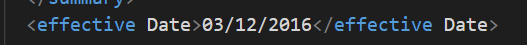
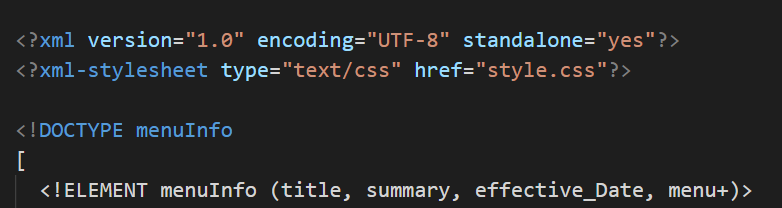
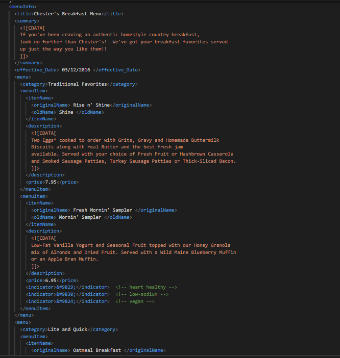
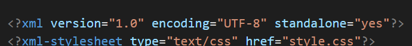
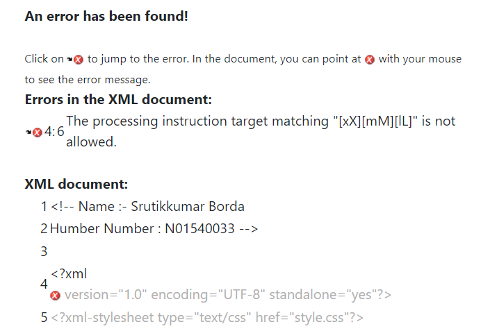

# Assignment 1: Theory Answers

1. I saw an error,while there is space between name of an element. we can not put space between two elements name.

2. We can clearly notify that CDATA is used to provide all the descreptive information and description about each and every items in the breakfast menu.
=> It shows that all the information as how it will be come to the guests and how you have to deal with that item.

3. We can add comment by using the same brackets like html.

4. 
=> Prolog

=> Document Body

=> Processing Instruction

=>  I am not able to find Epilog.

5. 

6. I tried to solved the error but in my code it will automatically takes new line in validate XML code in browser so only that give me an error.

