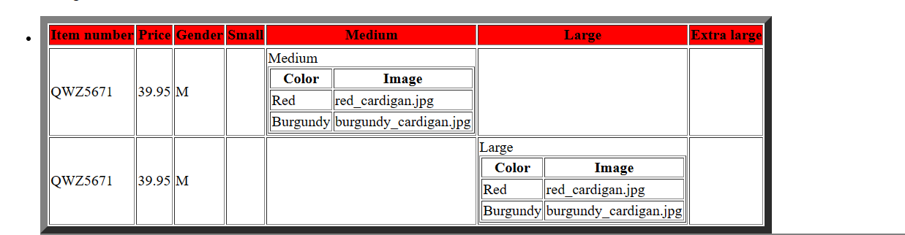
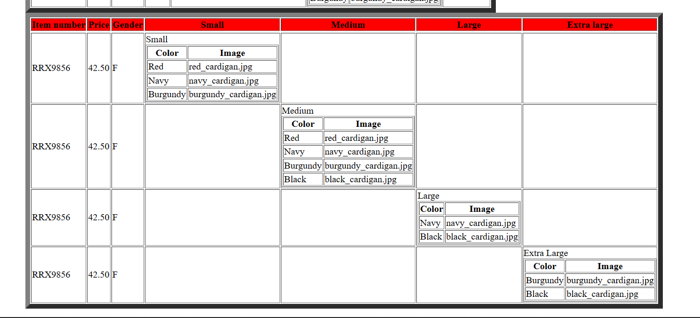

1. Main Title is "Catalog"
- Add title to the XSL file as a CATALOG.

2. Display Product id as h3
- take H3 tag for product id display.

3. Display Product Description as Paragraph
- p tag for display paragraph as product discription.

4. Table_1

5. Table=2
